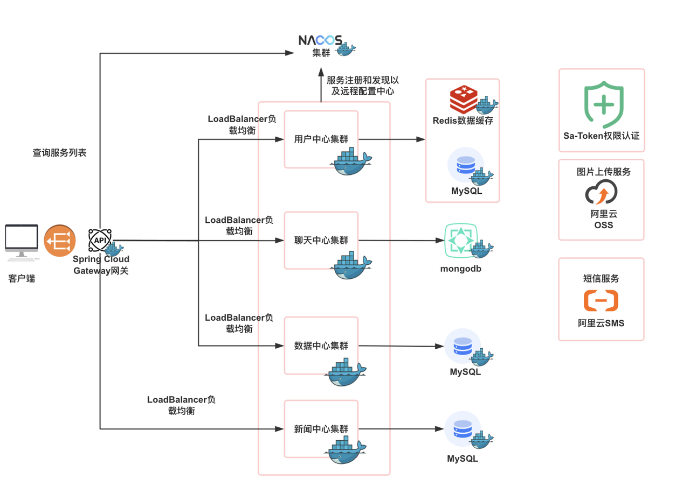

# backend

服务端：Spring Cloud，Spring Boot，mybatis-plus等。注册中心：nacos；权限认证：sa-token。

数据库：mysql，redis，mongodb。

云服务：使用阿里云OSS作为图片的云存储平台，使用阿里云短信服务sms进行手机验证码发送。

#### 注册中心

使用Spring Cloud Alibaba Nacos作为服务注册和发现以及远程配置中心。

- Nacos集群部署：为了提高注册中心的可用性和稳定性，可以将Nacos部署为集群模式，避免单点故障影响整个系统。
- 服务健康检查：利用Nacos提供的健康检查机制，自动剔除不健康的服务实例，保证服务的高可用性。

#### API网关

基于Spring Cloud Gateway项目开发了我们的API网关，通过从Nacos动态获取运行中的服务节点，将客户端请求进行路径解析和分发至对应的服务集群。同时，使用Spring Cloud LoadBalancer实现请求的负载均衡。

#### 用户中心

我们使用Sa-Token这一轻量级Java权限认证框架开发用户服务，用户信息持久化到MySQL数据库中，Session会话和token信息通过Redis缓存处理，多个用户服务节点共享Session会话信息，实现用户服务的高并发和高可用。

#### 聊天中心

我们通过mongodb记录用户和大模型的聊天记录。

#### 数据中心

通过MyBatis-Plus快速开发股票数据的CRUD操作。

#### 新闻中心

提供热点新闻的访问接口。

#### 云服务

我们使用阿里云SMS用于验证码发送服务，使用阿里云OSS存储图片等大文件。

- 图片处理服务：集成阿里云的图片处理服务，优化图片的存储和传输。
